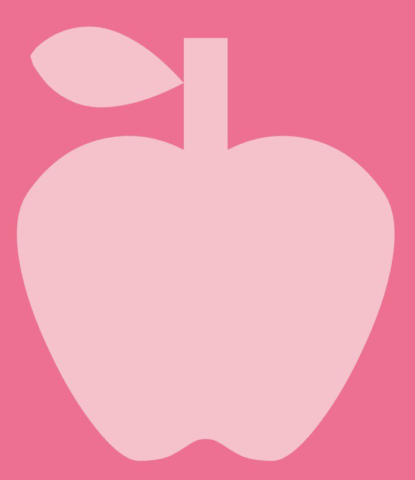
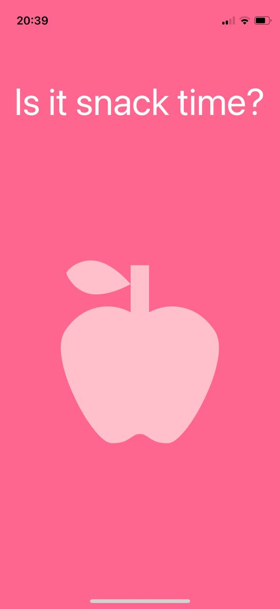
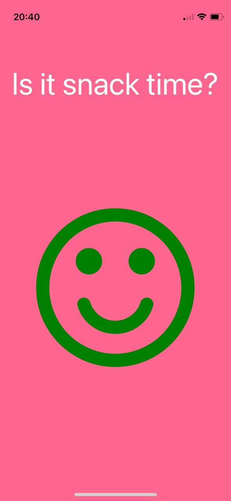
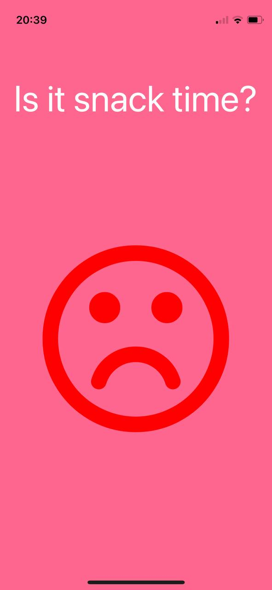

<div id="top"></div>


<br />
<div align="center">
  <a href="https://github.com/smwilton/snack-app">
    
  </a>

<h3 align="center">Snack Time App</h3>

  
</div>


<!-- TABLE OF CONTENTS -->
<details>
  <summary>Table of Contents</summary>
  <ol>
    <li>
      <a href="#about-the-project">About The Project</a>
      <ul>
        <li><a href="#built-with">Built With</a></li>
      </ul>
    </li>
    <li>
      <a href="#getting-started">Getting Started</a>
      <ul>
        <li><a href="#prerequisites">Prerequisites</a></li>
        <li><a href="#installation">Installation</a></li>
      </ul>
    </li>
    <li><a href="#contact">Contact</a></li>
  </ol>
</details>


<!-- ABOUT THE PROJECT -->
## About The Project

I created this app to make it easier to let my kid's know in a fun way if it's their snack time or not. By pushing the apple, either a green smiley face will appear or a red sad face. This will depend on the times coded in the app.






<p align="right">(<a href="#top">back to top</a>)</p>


### Built With


* [ReactNative.js](https://reactnative.dev/)

<p align="right">(<a href="#top">back to top</a>)</p>


<!-- GETTING STARTED -->
## Getting Started

To get a local copy up and running follow these simple example steps.

### Prerequisites


* npm
  ```sh
  npm install npm@latest -g
  ```

* react-native
  ```sh
  npm install react-native
  ```

### Installation


1. Clone the repo
   ```sh
   git clone https://github.com/smwilton/snack-app.git
   ```
2. Install NPM packages
   ```sh
   npm install
   ```


<p align="right">(<a href="#top">back to top</a>)</p>


<!-- CONTACT -->
## Contact

Sandra Wilton - https://www.linkedin.com/in/sandra-wilton-9a2298242/

Project Link: [https://github.com/smwilton/snack-app](https://github.com/smwilton/snack-app)

<p align="right">(<a href="#top">back to top</a>)</p>


<!-- MARKDOWN LINKS & IMAGES -->
<!-- https://www.markdownguide.org/basic-syntax/#reference-style-links -->
[contributors-shield]: https://img.shields.io/github/contributors/github_username/repo_name.svg?style=for-the-badge
[contributors-url]: https://github.com/github_username/repo_name/graphs/contributors
[forks-shield]: https://img.shields.io/github/forks/github_username/repo_name.svg?style=for-the-badge
[forks-url]: https://github.com/github_username/repo_name/network/members
[stars-shield]: https://img.shields.io/github/stars/github_username/repo_name.svg?style=for-the-badge
[stars-url]: https://github.com/github_username/repo_name/stargazers
[issues-shield]: https://img.shields.io/github/issues/github_username/repo_name.svg?style=for-the-badge
[issues-url]: https://github.com/github_username/repo_name/issues
[license-shield]: https://img.shields.io/github/license/github_username/repo_name.svg?style=for-the-badge
[license-url]: https://github.com/github_username/repo_name/blob/master/LICENSE.txt
[linkedin-shield]: https://img.shields.io/badge/-LinkedIn-black.svg?style=for-the-badge&logo=linkedin&colorB=555
[linkedin-url]: https://linkedin.com/in/linkedin_username
[product-screenshot]: images/screenshot.png